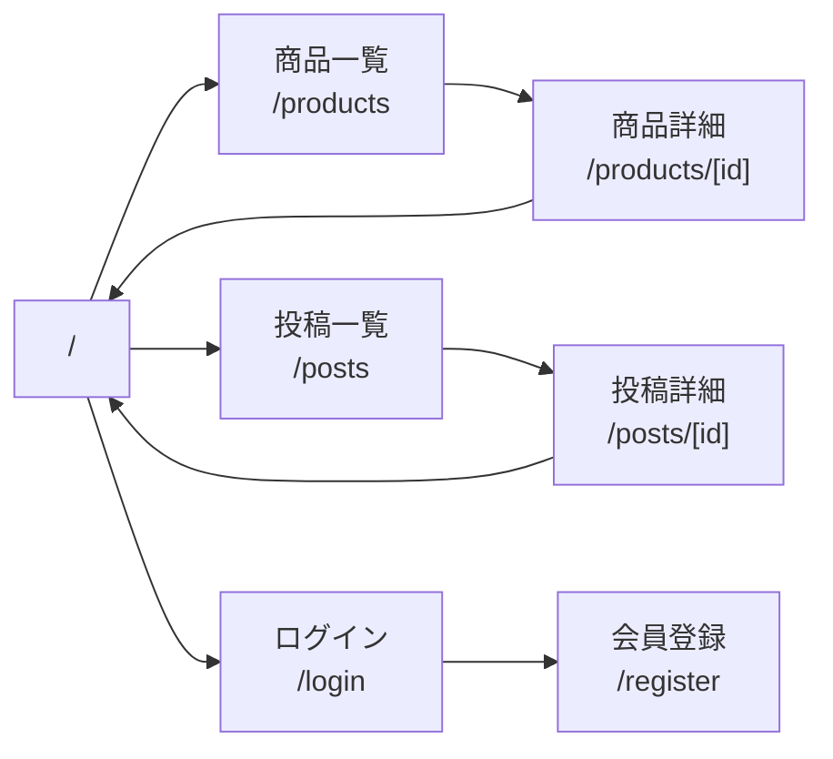

# Pride - SNS × EC プラットフォーム

> 買ったモノを自慢できる、SNS 型 EC サイト

## 📖 ドキュメント

- **[🚀 開発を始める](./GETTING_STARTED.md)** - まずはここから！次にやることガイド
- [ディレクトリ構成ガイド](./docs/DIRECTORY_STRUCTURE.md) - Backend/Frontend の推奨構成
- [開発計画](./DEVELOPMENT_PLAN.md) - プロジェクト全体の開発計画とロードマップ
- [ワークフロー](./.github/WORKFLOW.md) - ブランチ戦略、開発フロー、コミット規約
- [サンプル Issue](./.github/SAMPLE_ISSUES.md) - Issue 作成の参考例

## 前提条件

- Docker Desktop
- Python pip
- npm and node.js

# Setup

## Mac

```sh
# 権限を付与してください
chmod +x run.sh

# 初期セットアップ
./run.sh setup

# compose up
./run.bat up

# compose down
./run.bat down
```

## Windows

```sh
# 初期セットアップ
run.bat setup

# compose up
run.bat up

# compose down
run.bat down
```

# URL まとめ

## Next.js

```sh
http://localhost:3000
```

## FastAPI

```sh
http://localhost:8000/api
```

### docs

```sh
http://localhost:8000/docs
```

## SQLAdmin

```sh
http://localhost/admin/
```

---

## 🚀 開発を始める前に

1. **開発計画を確認**: [DEVELOPMENT_PLAN.md](./DEVELOPMENT_PLAN.md) でプロジェクト全体の流れを把握
2. **GitHub ラベル設定**: ラベルは自動同期されます（`backend`, `frontend`, `bug`, `feature`, `task`, `high`, `medium`, `low`）。必要に応じてメンテナが追加します。
3. **ワークフロー確認**: [WORKFLOW.md](./.github/WORKFLOW.md) でブランチ戦略とコミット規約を確認
4. **最初の Issue 作成**: [SAMPLE_ISSUES.md](./.github/SAMPLE_ISSUES.md) を参考に Issue #1（データベース設計）から始める

## 📋 現在の開発状況

- ✅ Phase 0: 開発環境整備完了
- 🔄 Phase 1: 基盤機能実装中（次: データベース設計）

詳細は [DEVELOPMENT_PLAN.md](./DEVELOPMENT_PLAN.md) を参照してください。

## ページ一覧

| ルート           | ファイル                                                               | 説明                     |
| ---------------- | ---------------------------------------------------------------------- | ------------------------ |
| `/`              | [`app/page.tsx`](../frontend/app/page.tsx)                             | ホームページ（フィード） |
| `/login`         | [`app/login/page.tsx`](../frontend/app/login/page.tsx)                 | ログインページ           |
| `/register`      | [`app/register/page.tsx`](../frontend/app/register/page.tsx)           | 会員登録ページ           |
| `/products`      | [`app/products/page.tsx`](../frontend/app/products/page.tsx)           | 商品一覧ページ           |
| `/products/[id]` | [`app/products/[id]/page.tsx`](../frontend/app/products/[id]/page.tsx) | 商品詳細ページ           |

例：）[id] = 1

| `/posts` | [`app/posts/page.tsx`](../frontend/app/posts/page.tsx) | 投稿一覧ページ |
| `/posts/[id]` | [`app/posts/[id]/page.tsx`](../frontend/app/posts/[id]/page.tsx) | 投稿詳細ページ |

例：）[id] = １


